# サメザリオ — ステージ・コース設計仕様書 (Stage & Course Design Plan)

**作成日**: 2026-08-16  
**ステータス**: Phase 1（地形パス再編・マスターデータ）実装済み。Phase 2 以降は未着手  
**対象**: 調布市全域の地理に即したステージ再編、コースギミック、現地写真照合による解放、ラスボス（深大寺）仕様

---

## 1. 概要とコンセプト

調布市の実際の地理・歴史・文化を色濃く反映し、「ゲーム内の探索」と「調布現地でのリアル回遊（写真撮影）」が連動するステージ設計を行う。

### 主要な改修・拡張ポイント
1. **地理の正確化とエリア再編**:
   - 従来の東側エリア（旧名：多摩川）を実態に合わせて **「つつじヶ丘・仙川」** に名称・設定変更。
   - 調布飛行場および調布駅・布田の南端（調布市南境）を帯状に切り取り、実際の流路に沿った **新「多摩川」エリア** を新設。
2. **深大寺の「ラスボスステージ」化**:
   - 他エリアを解放・踏破することで挑戦可能となる高難易度ボスステージに位置付け。巨大ボスBotや特殊な湧水ギミックを配置。
3. **各コースの完全差別化**:
   - コースごとの専用餌（調布市郷土博物館の展示物モチーフ。土製耳飾、渦巻きかわらけ、飛燕のプロペラなど）
   - コース固有の環境・物理ギミック（多摩川の水流カレント、飛行場のプロペラ気流、深大寺の湧水バフなど）

---

## 2. マップ構成・進行フロー

### 2.1 ステージ進行チャート

```mermaid
graph TD
    Chofu["① 調布駅・布田<br>【初期解放】<br>映画のまち・標準バランス"]
    
    subgraph "エリア探索 & 現地写真照合で解放"
        Tsutsuji["② つつじヶ丘・仙川<br>文学・音楽の街<br>（実篤公園 / 仙川）"]
        Airport["③ 調布飛行場<br>滑走路とプロペラの風<br>（味スタ / 武蔵野の森）"]
        Tamagawa["④ 多摩川<br>最速の清流・花火大会<br>（郷土博物館 / 河川敷）"]
    end

    Chofu -->|現地写真で解放| Tsutsuji
    Chofu -->|現地写真で解放| Airport
    Chofu -->|現地写真で解放| Tamagawa

    Tsutsuji & Airport & Tamagawa -->|全エリア解放でアンロック| Jindaiji["⑤ 深大寺【ボスステージ】<br>古刹と湧水・巨大ボスサメ決戦<br>（深大寺 山門）"]
```



---

## 3. 全5ステージ 詳細仕様

| ID | ステージ名 | 地理的位置 | 解放条件 | 固有ギミック / 特徴 | 専用餌・モチーフ |
|---|---|---|---|---|---|
| `chofu` | **調布駅・布田** | 中央部 | **初期解放** | すべての始まりの海。標準バランス | 土製耳飾（下布田遺跡） |
| `sengawa` | **つつじヶ丘・仙川** | 東部 | 写真照合<br>（実篤公園等） | 狭い路地とカフェ。小回りと加速が活きる水域 | 金子宿の往来手形 |
| `airport` | **調布飛行場** | 西部・北西部 | 写真照合<br>（味スタモニュメント） | **プロペラ気流**: 定期的な突風・餌の吸引ゾーン | 飛燕のプロペラ |
| `tamagawa` | **多摩川** | 南部（新設） | 写真照合<br>（調布市郷土博物館） | **急流カレント**: 下流方向へ加速、上流へ抵抗 | 古代の麻布 |
| `jindaiji` | **深大寺**<br>*(BOSS STAGE)* | 北部 | **全エリア解放**<br>＋山門写真 | **ラスボスサメ出現**: 巨大ボスとの決戦、湧水回復ゾーン | 渦巻きかわらけ（深大寺城跡） |

専用餌は **調布市郷土博物館の常設展示・収蔵資料がモチーフ**（#17）。当初案の風物モチーフ
（映画フィルム、音符、花火玉、アユ等）から差し替えた。ゲームプレイが常設展示室を巡る
きっかけになることを狙っており、**選定の正は #17**。各エリアの本命・対抗と選定理由、
および「サメ図鑑」を拡張した**遺物図鑑**は #17 を参照。

---

### 詳細各論

#### ① 調布駅・布田 (`chofu`)
- **テーマ**: 映画のまち・すべての始まりの海
- **色 / 水色**: 赤 (`#c0544c`) / 水色 (`#2a7b7c`)
- **サイズ**: 4200
- **解説**: 駅前ロータリーと商業施設、天神通り商店街。標準的な操作感で基本を学ぶチュートリアル兼メインエリア。
- **専用餌**: 土製耳飾（下布田遺跡出土 / 国指定重要文化財）　対抗: 太閤の制札（布多天神社所蔵）

#### ② つつじヶ丘・仙川 (`sengawa`)
- **テーマ**: 文学と音楽、調布カルチャーの東の玄関口
- **色 / 水色**: 緑 (`#4e8a5f`) / 水色 (`#285868`)
- **サイズ**: 5000
- **解説**: 武者小路実篤記念館や桐朋学園が位置する文化の街。入り組んだ地形と狭い通路でテクニカルな立ち回りが求められる。
- **専用餌**: 金子宿の往来手形 / 金子村古文書　対抗: 武者小路実篤の原稿用紙・愛用筆
- 色とサイズは旧・東部エリア（改称前の `tamagawa`）から引き継いだ。#52 は改称と区割りの変更なので、
  対戦バランスに効く `size` と、元絵の塗り分けに従っている色はどちらも動かしていない（下の「計画との差分」参照）

#### ③ 調布飛行場 (`airport`)
- **テーマ**: 滑走路と武蔵野の森、プロペラの風
- **色 / 水色**: 黄・アンバー (`#d8a72c`) / 水色 (`#2b7280`)
- **サイズ**: 4400
- **ギミック**: **プロペラ気流（Jet Stream）**
  - 滑走路ライン上で定期的に強い気流が発生し、サメが一気にダッシュ加速する、または周囲の餌が渦巻き状に吸い寄せられる。
- **専用餌**: 戦闘機「飛燕」のプロペラ / 掩体壕関連資料　対抗: 飛行帽・航空日誌

#### ④ 多摩川 (`tamagawa`) [新設]
- **テーマ**: 最大・最速の清流、河川敷の花火大会
- **色 / 水色**: 紫 (`#8e5aa8`) / 清流水色 (`#2f7f86`)
- **サイズ**: 4400
- **地形**: 調布駅・飛行場の南側を東西に横断する細長いリバーサイド地形。
  外接矩形の 34% しか中身がなく、実測でいちばん細い通路になる（§4.3）
- **ギミック**: **急流カレント（River Current）**
  - 西（上流）から東（下流）に向かって一定の水流ベクトルが発生。流れに乗ると高速移動でき、逆らうと減速する。
- **専用餌**: 古代の麻布（調布の由来・貢納布）　対抗: 蛇体装飾付土器（染地遺跡出土）

#### ⑤ 深大寺 (`jindaiji`) — 【ラスボスステージ】
- **テーマ**: 天平の古刹、湧水とそば、神代植物公園
- **色 / 水色**: 青灰 (`#6c88ad`) / 深緑水底 (`#26696f`)
- **サイズ**: 4600
- **解放条件**: `chofu`, `sengawa`, `airport`, `tamagawa` の全ステージ解放 ＋ 深大寺山門の写真照合
- **ボスギミック**: **「深大寺主・メガロドン」/「湧水の大神」**
  - 超巨大なボスBot（圧倒的な体長と質量）が水域を巡回。
  - ボスを撃破（頭部を自分の胴体または外壁に衝突させる）すると超大量の高得点餌が飛散し、ステージクリア報酬を獲得。
- **環境ギミック**: **湧水清流スポット**
  - 湧水ゾーンに入るとスタミナ回復速度が2倍になり、そばガード効果を一時的に付与。
- **専用餌**: 渦巻きかわらけ（深大寺城跡出土）　対抗: 武蔵型板碑

---

## 4. 地形（SVG Path）— 作り方と実測値

### 4.1 パイプライン（#52 で実装済み）

輪郭は**手で書かない**。色分けした元絵を原本に据えて、2本のスクリプトを順に通す。

```
public/img/chofu_map.png  →  scripts/trace-areas.py  →  scripts/seal-arms.mjs  →  src/data.js
   5エリアを色で塗った原本      色ごとに輪郭を抽出          細すぎる腕を落とす        path
```

- **`trace-areas.py`** — 色で分類 → **白い区切り線を両側のエリアで奪い合って埋める** → 外周を閉じ直す
  → 最大の塊だけ残す → 穴を埋める → 隣と少しだけ重ねる → Moore 近傍で外周を1本たどる
  → viewBox 座標へ写す → Douglas-Peucker で間引く。
  元絵はエリアどうしを白い線で区切って描いてあるので、色で拾っただけだとその線の幅が
  そのまま**エリア間の隙間**として地図に残る。奪い合わせる工程がそれを潰している
- **`seal-arms.mjs`** — 二値画像のオープニング（収縮 → 最大の塊だけ残す → 膨張）。
  `MIN_PASSAGE = 360`（ワールドpx）より細い腕は、サメが通れないので落とす。
  取り出したままの path はこのスクリプトの `ORIGINAL` に残っている

元絵を差し替えたら、この2本を通し直して `src/data.js` の `path` を置き換える。
`path` を手で継ぎ足すと図形が閉じなくなる（#56 で実際に壊れ、#57 で revert した）。

### 4.2 `size` は一辺ではない —— 選択画面の見た目と遊ぶ広さは一致しない

**ここが最も誤解しやすい。** `src/data.js` の `path` は、ロケ地選択画面のクリック領域であると
同時に**ゲーム中のプレイエリアの外周そのもの**で、間に別の地形データは存在しない。
`makeArena()`（`src/sim.js`）がやるのは一様拡大ひとつだけ:

```
k = size / √(輪郭の面積)     → 拡大後の面積がちょうど size² になる
```

つまり **`size` は「一辺」ではなく実効プレイ面積の平方根**。形をどう描き替えても遊べる広さは
`size` が決めるので、5エリアはそれぞれ違う倍率で拡大される。

その結果、**選択画面で小さく見えるエリアが、実際には最も広いことがある**。多摩川がまさにそれで、
図では5つのうち最小（面積 46,076）なのに、面積を `size²` に揃える都合で倍率が最大になり、
ワールドでは**横 10,536px と最長のアリーナ**になる。遊べる広さも調布駅・布田を上回る。

区割りを変えても `size` を据え置けば遊べる広さは変わらない —— #52 で調布駅・布田と調布飛行場から
南部を切り出しても `size` を 4200 / 4400 のまま置いたのはそのため。餌の量も `FOOD_PER_AREA` が
面積から決めるので、密度も据え置きになる。

### 4.3 実測値

| ID | 選択画面での面積 | 倍率 `k` | ワールド外接矩形 | `size` | 矩形の充填率 |
| --- | ---: | ---: | --- | ---: | ---: |
| `chofu` | 68,374 | 16.06 | 6730 × 3983 | 4200 | 66% |
| `jindaiji` | 127,028 | 12.91 | 4220 × 6285 | 4600 | 80% |
| `tamagawa` | **46,076** | **20.50** | **10536 × 5453** | 4400 | **34%** |
| `airport` | 99,977 | 13.92 | 4703 × 6833 | 4400 | 60% |
| `sengawa` | 97,714 | 16.00 | 6414 × 6958 | 5000 | 56% |

「どれくらい広く感じるか」は外接矩形ではなく**壁までの距離**で決まる。
プレイエリアを 24px 格子へ焼いて距離変換をかけた実測:

| ID | 通路の幅（中央値） | 内接円の最大半径 | 端から端まで |
| --- | ---: | ---: | ---: |
| `chofu` | 1152 px | 1704 | 5.5 画面ぶん |
| `jindaiji` | 1360 px | 1992 | 3.5 画面ぶん |
| `tamagawa` | **768 px** | 1248 | **8.6 画面ぶん** |
| `airport` | 1120 px | 2072 | 3.9 画面ぶん |
| `sengawa` | 1024 px | 1688 | 5.3 画面ぶん |

基準: 初期サメは半径 12.9px・体長 47px・素の速さ 172px/s。画面幅 1280px の端末で初期ズーム 1.05、
見えるワールド幅は 1219px（`src/game.js` の `wantZoom`）。

**多摩川の遊び味**: 横幅が画面の 0.6 枚ぶんしかない廊下が、画面 8.6 枚ぶん続く。横に逃げる余地が
他エリアの約 2/3 なので、航跡（ダッシュ中に残る帯）での囲い込みが決まりやすく、壁の押し戻しに
当たる頻度も上がる。§3 ④ の「急流カレント」を載せる土台としては噛み合うが、**窮屈すぎないかは
実機で確かめる必要がある**。狭いと判断したら `size` を上げる（面積が増えて廊下も太くなる）か、
元絵の帯を太く描き直すかの二択になる。

なお通路の細さには下限がある。`seal-arms.mjs` の `MIN_PASSAGE = 360` がサメの通れない突起を
落とすので、実測 768px はその倍以上あり、どこも詰まらない。選択画面で調布飛行場の北の細い腕が
消えているのは、この処理が設計どおり落としている分。

### 4.4 計画との差分（#52 時点）

§3 の当初案から、実装で意図的に変えたもの:

| 項目 | 当初案 | 実装 | 理由 |
| --- | --- | --- | --- |
| `sengawa` の色 | 紫 `#8e5aa8` | 緑 `#4e8a5f` | 元絵 `chofu_map.png` の塗り分けが東＝緑。図と画面を食い違わせない |
| `tamagawa` の色 | 緑 `#4e8a5f` | 紫 `#8e5aa8` | 元絵では黒。暗い水面の上で見えないので、空いた紫を回した |
| `sengawa` の `size` | 4300 | 5000（据え置き） | #52 は改称と区割りの変更。`size` を動かすと対戦バランスが変わる |
| `jindaiji` の `size` | 4800 | 4600（据え置き） | 同上。ボス化（Phase 4）と合わせて見直す |
| `tamagawa` の `size` | 5000 | 4400 | 既存4エリアを据え置いた上での相対値。§4.3 のとおり実効面積では最長になる |

色の入れ替えは元絵を正とした判断なので、**当初案どおり（仙川＝紫 / 多摩川＝緑）に戻すなら
元絵の塗り分けも一緒に直す**こと。片方だけ変えると、次に輪郭を取り直した人が図と画面の
食い違いに気づけない。

### 4.5 環境ギミックの実装値（#83）

§3 のギミックは `src/data.js` の `MAPS[].gimmick` が数値を全部持ち、`src/sim.js` の
`makeGimmick()` が式だけを持つ。**位置は外接矩形の 0..1** で書くので、`size` を動かしても
輪郭に対する位置は変わらない。ギミックの無い `chofu` / `sengawa` では `world.gimmick` が
`null` になり、判定も配信も従来どおり素通りする。

| エリア | kind | 効き | 実測・根拠 |
| --- | --- | --- | --- |
| `tamagawa` | `current` | 速度ベクトルに `dir=0.32rad` / `48px/s` を加算 | 向きは輪郭の主軸の実測（18.3°）。素の速さ 172px/s の 28%＝2秒で 429px（下流）対 237px（上流） |
| `airport` | `gust` | 滑走路の帯（半幅 340px）で 9 秒ごとに 2.6 秒、サメを `205px/s` で押し、餌を `320px/s` で吸う | 滑走路は `(0.30,0.30)-(0.38,0.82)`＝実座標 3570px の北北西→南南東。半幅は 440px まで輪郭の内側（`sim.test.mjs` が全周を検査） |
| `jindaiji` | `spring` | 半径 460px の湧水ゾーン3か所。スタミナ回復 2倍 ＋ そばガード | ゾーンは `(0.30,0.30)` `(0.62,0.52)` `(0.40,0.78)`。半径 520px まで輪郭の内側 |

**サーバとブラウザで同じ位相が回ること**が周期ギミックの生命線なので、`world.envT`
（環境の時計）をスナップショットの `e` に載せて揃えている。`elapsed` と分けてあるのは、
`elapsed` が航跡の寿命の基準でもあり、上書きすると死んだはずの帯が生き返るから。
気流の窓は `sin` で立ち上がり／立ち下がりを丸めてあり、吹き始めに速度が段差で変わらない。

餌の吸引だけは `authority` に閉じず**両側が回す**。スナップショットは餌の座標を配り直さない
（増えた分と消えた分しか送らない）ので、authority に閉じると予測側の餌は吸われずその場に
残ってしまう。同じ式を同じ時計で回すぶんには答えは揃うし、寄せ先が同じ滑走路なので
多少ずれても離れていかない。渦の芯（`core=120px`）より内側では寄せるのをやめて回すだけに
する ―― 入れないと帯の餌が数回の気流で滑走路の1本線に潰れきる。

**§3 で読み取れなかった2点の判断:**

- **「そばガード効果を一時付与」**（§3 ⑤）は、深大寺サメのスキル（`main.js` の
  `jindaiji: 'shield'`）と**同じ一撃ぶんの盾**とみなした。湧水に浸かっている間だけ張り直し、
  ゾーンを出ると 0.9 秒で切れる＝「一時」。専用の別効果を新設していない
- **霧（視界制限）**（`concept-roadmap.md` §2.2）は**入れていない**。視界制限は描画側だけの
  話で、サーバが持つ必要が無い＝`sim.js` に載らない。入れるなら `game.js` 単独の変更として
  別 Issue で扱う

`size` / `speed` は動かしていない（§4.4 の判断に従う）。ギミックは既存のバランスの上に
足す形で、`sim.js` 冒頭の定数はどれも触っていない。

---

## 5. 実装ロードマップ

### Phase 1: 地形パス再編とマスターデータ更新
- [x] `src/data.js`: `MAPS` に `sengawa` を追加、`tamagawa` を南側新パスに差し替え。（#52）
- [ ] `jindaiji` に boss フラグを設定。—— 解放条件と `size` の見直しごと Phase 4 へ送った
- [x] 地形生成スクリプト（`scripts/trace-areas.py` → `scripts/seal-arms.mjs`）で5つのクリーンなSVGパスを生成。（§4.1）
- [x] `src/geo.test.mjs` および `src/sim.test.mjs` で全5エリアの幾何計算とアリーナ生成テストをパスさせる。

### Phase 2: 進捗管理 & 写真照合システム
- [ ] `src/progress.js`: エリア解放・達成スポット・ポイント管理モジュール作成（`clearSpot`, `isMapUnlocked`）。
- [ ] `src/verify.js`: 写真照合ロジック（`verifyPhoto`、デバッグ即時解放機能付き）。
- [ ] `src/main.js` / `index.html`: ロケ地選択画面の5エリア対応、写真撮影/アップロードUI、解放演出。

### Phase 3: コース専用ビジュアル & 専用餌
- [ ] `src/sim.js`: `food.kind` にマップごとのタイプ（土製耳飾、往来手形、飛燕のプロペラ、古代の麻布、渦巻きかわらけ）を追加。（#17）
- [ ] `src/game.js`: 各専用餌のCanvas2D描画ロジックおよび背景水域エフェクトの実装。
- [ ] 「サメ図鑑」を「図鑑」へ拡張し、集めた展示物モチーフの餌を遺物図鑑として閲覧可能にする。（#17）

### Phase 4: コース固有ギミック & ボスシミュレーション
- [x] `src/sim.js`: 多摩川の「水流ベクトル」、飛行場の「プロペラ突風」、深大寺の「湧水ゾーン」をシミュレーションに追加（サーバ・クライアント同一ロジック）。（#83、実装値は §4.5）
- [ ] `src/sim.js`: 深大寺ボスBotのAI（巨大サイズ・特殊行動ルーチン）を実装。
- [ ] `server/index.mjs`: サーバ側の各ステージ部屋でボスやギミックが同期動作することを確認。

### Phase 5: 結合テスト・バランス調整
- [ ] `npm test`（`node --test`）の全通過。
- [ ] `npm run build` の検証。
- [ ] 実機・ブラウザでの負荷・描画パフォーマンステスト。
