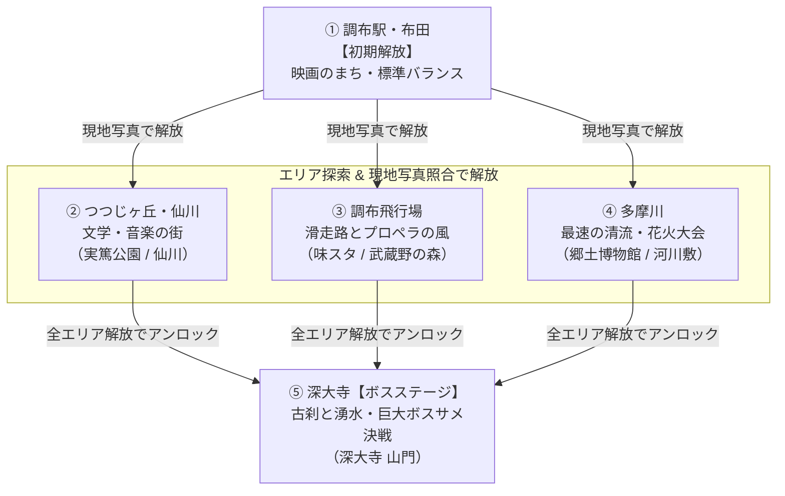

# サメザリオ — ステージ・コース設計仕様書 (Stage & Course Design Plan)

**作成日**: 2026-08-16  
**ステータス**: 確定・実装準備中  
**対象**: 調布市全域の地理に即したステージ再編、コースギミック、現地写真照合による解放、ラスボス（深大寺）仕様

---

## 1. 概要とコンセプト

調布市の実際の地理・歴史・文化を色濃く反映し、「ゲーム内の探索」と「調布現地でのリアル回遊（写真撮影）」が連動するステージ設計を行う。

### 主要な改修・拡張ポイント
1. **地理の正確化とエリア再編**:
   - 従来の東側エリア（旧名：多摩川）を実態に合わせて **「つつじヶ丘・仙川」** に名称・設定変更。
   - 調布飛行場および調布駅・布田の南端（調布市南境）を帯状に切り取り、実際の流路に沿った **新「多摩川」エリア** を新設。
2. **深大寺の「ラスボスステージ」化**:
   - 他エリアを解放・踏破することで挑戦可能となる高難易度ボスステージに位置付け。巨大ボスBotや特殊な湧水ギミックを配置。
3. **各コースの完全差別化**:
   - コースごとの専用餌（映画フィルム、そば/だるま、花火/魚、プロペラ、音符/本など）
   - コース固有の環境・物理ギミック（多摩川の水流カレント、飛行場のプロペラ気流、深大寺の湧水バフなど）

---

## 2. マップ構成・進行フロー

### 2.1 ステージ進行チャート

---

## 3. 全5ステージ 詳細仕様

| ID | ステージ名 | 地理的位置 | 解放条件 | 固有ギミック / 特徴 | 専用餌・モチーフ |
|---|---|---|---|---|---|
| `chofu` | **調布駅・布田** | 中央部 | **初期解放** | すべての始まりの海。標準バランス | 映画フィルム、カチンコ |
| `sengawa` | **つつじヶ丘・仙川** | 東部 | 写真照合 （実篤公園等） | 狭い路地とカフェ。小回りと加速が活きる水域 | 音符、文庫本、ツツジの花 |
| `airport` | **調布飛行場** | 西部・北西部 | 写真照合 （味スタモニュメント） | **プロペラ気流**: 定期的な突風・餌の吸引ゾーン | プロペラ、計器、紙飛行機 |
| `tamagawa` | **多摩川** | 南部（新設） | 写真照合 （調布市郷土博物館） | **急流カレント**: 下流方向へ加速、上流へ抵抗 | 花火玉、アユ、小石 |
| `jindaiji` | **深大寺** *(BOSS STAGE)* | 北部 | **全エリア解放** ＋山門写真 | **ラスボスサメ出現**: 巨大ボスとの決戦、湧水回復ゾーン | そば猪口、だるま、湧水玉 |

---

### 詳細各論

#### ① 調布駅・布田 (`chofu`)
- **テーマ**: 映画のまち・すべての始まりの海
- **色 / 水色**: 赤 (`#c0544c`) / 水色 (`#2a7b7c`)
- **サイズ**: 4200
- **解説**: 駅前ロータリーと商業施設、天神通り商店街。標準的な操作感で基本を学ぶチュートリアル兼メインエリア。

#### ② つつじヶ丘・仙川 (`sengawa`)
- **テーマ**: 文学と音楽、調布カルチャーの東の玄関口
- **色 / 水色**: 紫・ピンク系 (`#8e5aa8`) / 水色 (`#2c6e78`)
- **サイズ**: 4300
- **解説**: 武者小路実篤記念館や桐朋学園が位置する文化の街。入り組んだ地形と狭い通路でテクニカルな立ち回りが求められる。
- **専用餌**: 音符、文庫本、ツツジの花びら

#### ③ 調布飛行場 (`airport`)
- **テーマ**: 滑走路と武蔵野の森、プロペラの風
- **色 / 水色**: 黄・アンバー (`#d8a72c`) / 水色 (`#2b7280`)
- **サイズ**: 4400
- **ギミック**: **プロペラ気流（Jet Stream）**
  - 滑走路ライン上で定期的に強い気流が発生し、サメが一気にダッシュ加速する、または周囲の餌が渦巻き状に吸い寄せられる。
- **専用餌**: プロペラ、航空計器、紙飛行機

#### ④ 多摩川 (`tamagawa`) [新設]
- **テーマ**: 最大・最速の清流、河川敷の花火大会
- **色 / 水色**: エメラルド緑 (`#4e8a5f`) / 清流水色 (`#2f7f86`)
- **サイズ**: 5000（横長・広大な水域）
- **地形**: 調布駅・飛行場の南側を東西に横断する細長いリバーサイド地形。
- **ギミック**: **急流カレント（River Current）**
  - 西（上流）から東（下流）に向かって一定の水流ベクトルが発生。流れに乗ると高速移動でき、逆らうと減速する。
- **専用餌**: 打ち上げ花火の火花玉、多摩川のアユ

#### ⑤ 深大寺 (`jindaiji`) — 【ラスボスステージ】
- **テーマ**: 天平の古刹、湧水とそば、神代植物公園
- **色 / 水色**: 藍・紺 (`#3b5a9c`) / 深緑水底 (`#26696f`)
- **サイズ**: 4800
- **解放条件**: `chofu`, `sengawa`, `airport`, `tamagawa` の全ステージ解放 ＋ 深大寺山門の写真照合
- **ボスギミック**: **「深大寺主・メガロドン」/「湧水の大神」**
  - 超巨大なボスBot（圧倒的な体長と質量）が水域を巡回。
  - ボスを撃破（頭部を自分の胴体または外壁に衝突させる）すると超大量の高得点餌が飛散し、ステージクリア報酬を獲得。
- **環境ギミック**: **湧水清流スポット**
  - 湧水ゾーンに入るとスタミナ回復速度が2倍になり、そばガード効果を一時的に付与。
- **専用餌**: そば猪口、赤いだるま、深大寺そば玉

---

## 4. 地形（SVG Path）の再編計画

現在の `chofu_map.png` および `MAPS` の輪郭パスを以下のように再編する。

1. **南側の切り取り**:
   - `chofu`（調布駅）および `airport`（飛行場）の南側下部を水平〜緩やかなカーブで切り取る。
2. **新「多摩川」の生成**:
   - 切り取った南側領域を東西に結合し、細長く広がる横長リバーサイドパスを新設。
3. **東部を「つつじヶ丘・仙川」として定義**:
   - 既存の東側パスを `sengawa` として登録。
4. **`scripts/seal-arms.mjs` による最適化**:
   - 各ポリゴンをラスタライズ・オープニング処理して細すぎる腕を落とし、`src/data.js` に出力。

---

## 5. 実装ロードマップ

### Phase 1: 地形パス再編とマスターデータ更新
- [ ] `src/data.js`: `MAPS` に `sengawa` を追加、`tamagawa` を南側新パスに差し替え、`jindaiji` に boss フラグを設定。
- [ ] 地形生成スクリプト（`scripts/seal-arms.mjs`）で5つのクリーンなSVGパスを生成。
- [ ] `src/geo.test.mjs` および `src/sim.test.mjs` で全5エリアの幾何計算とアリーナ生成テストをパスさせる。

### Phase 2: 進捗管理 & 写真照合システム
- [ ] `src/progress.js`: エリア解放・達成スポット・ポイント管理モジュール作成（`clearSpot`, `isMapUnlocked`）。
- [ ] `src/verify.js`: 写真照合ロジック（`verifyPhoto`、デバッグ即時解放機能付き）。
- [ ] `src/main.js` / `index.html`: ロケ地選択画面の5エリア対応、写真撮影/アップロードUI、解放演出。

### Phase 3: コース専用ビジュアル & 専用餌
- [ ] `src/sim.js`: `food.kind` にマップごとのタイプ（フィルム、そば、だるま、花火、プロペラ、音符等）を追加。
- [ ] `src/game.js`: 各専用餌のCanvas2D描画ロジックおよび背景水域エフェクトの実装。

### Phase 4: コース固有ギミック & ボスシミュレーション
- [ ] `src/sim.js`: 多摩川の「水流ベクトル」、飛行場の「プロペラ突風」、深大寺の「湧水ゾーン」をシミュレーションに追加（サーバ・クライアント同一ロジック）。
- [ ] `src/sim.js`: 深大寺ボスBotのAI（巨大サイズ・特殊行動ルーチン）を実装。
- [ ] `server/index.mjs`: サーバ側の各ステージ部屋でボスやギミックが同期動作することを確認。

### Phase 5: 結合テスト・バランス調整
- [ ] `npm test`（`node --test`）の全通過。
- [ ] `npm run build` の検証。
- [ ] 実機・ブラウザでの負荷・描画パフォーマンステスト。
